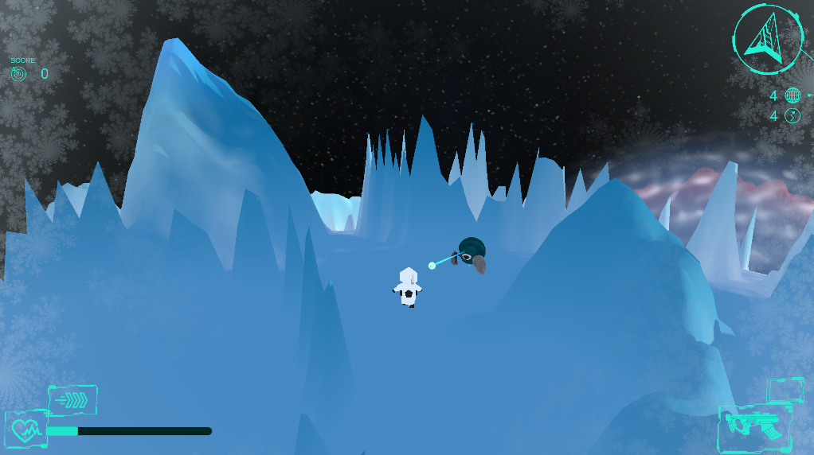

[](https://classroom.github.com/online_ide?assignment_repo_id=451468&assignment_repo_type=GroupAssignmentRepo)


**The University of Melbourne**
# COMP30019 – Graphics and Interaction

Final Electronic Submission (project): **11:59am, November 1**

Gameplay Video: https://www.youtube.com/watch?v=JG4XtFds0qE

## Table of contents
* [Team Members](#team-members)
* [Explanation of the game](#explanation-of-the-game)
* [Game Design](#game-design)
* [Procedural Terrain Generation](#procedural-terrain-generation)
  * [Planets](#planets)
  * [Clouds](#clouds)
  * [Sun](#sun)
  * [Universe & Enemy & Objects, Orientation & Position](#enemy)
* [Shaders](#shaders)
  * [Icey Shader](#a1)
  * [Drunk Shader](#a2)
* [Particle System](#particle-system)
* [Evaluation Methods](#evaluation-methods)
* [Technologies](#technologies)
* [References](#references)

## Team Members

| Name | Task |
| --- | --- |
| Louis Nowell-Nicolle  | README Format, Drunk Shader, Player controls and camera, powerups and gun code, Player Animation, Statistics, Dash Particle system, HUD layout and back end, Movement scripts on sphere, Gameplay code like health, Lighting |
| Yasser Hamdan   | Planet Terrain Generation, Universe Generation, Planet Surface Shader, Planet Shape and Colour Design, Spawning logic, System Generation Script, Tutorial Scene, Sun Particle Effects, Bullet Particle Effects, Music, Procedural Cloud Generation, Lighting | 
| Konstantine Huffman | Planet Terrain Generation, Planet Object Generation, Universe Generation, Main Menu (Whole Scene, Cameras, Options, Statistics), Pause Menu, Death Menu, Gameplay HUDs (Tutorial & Main Game, Design & Implementation), Base Enemy Mesh & Animation, Shooting & 'Getting Shot' Particle Effects, Art Direction |  
| Tim Bunnage   | Enemy gameplay and design, Icy Shader, Evaluation Methods, Guns and Projectiles, Player logic |  

## Explanation of the game
Welcome to SPACE! A Third-Person Shooter (TPS) set in the Year 3130, when the last remnants of humanity desperately hurtle into the unknown, looking for a new solar system to rebuild civilization. You play as the one of several volunteer scouts, sent to survey planets for a potential new home.  
The objective of the game is simple; having crash landed in the wrong space system, you wake up to discover you’re not alone… If the fleet of settlers are to come to your lowly planet, you must fight your way through the system, securing local space and giving yourself a chance to survive!
Each run through of the game is a unique experience, and never once the same. Your whole environment; planets & terrain, enemies, objectives and supplies are randomly generated, scattered over new planets in a new space system with each play through. Discover exotic planets, each with different climates, terrain, enemies and helpful items! 
Make your way through the system, and reach the enemy hive to win! Each run is a race against time, and so your score ticks down with every passing second! 
This dark-souls inspired game is perfect for those that like a challenge, and has endless replayability with new dynamics and scalable difficulty, encouraging players to achieve the cleanest run possible!
(See tutorial and options for controls and a gameplay walkthrough).


## Game Design

### Artwork & Inspiration (How you designed objects and entities)
How you designed objects and entities.
The gameplay style was inspired by classic Shooters, Bullet-Hell, RTS and Objective-based games spanning multiple genres; including Halo, Doom, Mario Galaxy and Planetary Annihilation. The core concept was an open-world space-based shooter where direction is meaningless, and your surroundings and visuals are playable elements. Particular focus is on the environment aesthetic and backdrop, with the decision to make the game ‘third-person’ in order to give players a sense of grandness of the universe they are in. 
Given the resource intensive nature of graphic and visual design, SPACE takes on a minimalist-geometry aesthetic, with surfaces, particles and entities being composed of simple geometric shapes, with varying colouring and texturing. To focus on core components and stylisation, use of the Unity Asset store is made for character meshes and some animations (excluding shaders), while all else in the game is fully custom built (see references for additional materials). 
### Gameplay 
Playthrough / Stages / Difficulty / Mechanics / pickups
Difficulty curves and game stages and objectives, etc.
The player begins on a themed planet, and must fight through enemies to reach the teleporter to jump to other themed planets. To make the journey easier, pickups can be found, which can either be different gun types or permanent bonuses.
The gameplay is intended to be challenging, and players are not expected to finish the game on their first attempt. The player will often find themselves fighting many enemies at once, evading masses of projectiles flying towards them. The gameplay is somewhat inspired from the bullet hell genre, in which fast reactions and skill are required to dodge the projectiles. To make dodging easier, the player can dash across the globe on a short cooldown.
The game has solid replayability due to the rando Each playthrough is slightly different based on the random
 
### Enemies
There are 2 basic types of enemies, an immovable turret, and a movable robot. The AI for both enemies is based on whether they can see the player or not, which is found by firing a raycast to the player. The raycast will ignore other enemies and projectiles, and only fail when hitting planet surfaces. If an enemy can see the player, it will point towards them and shoot at them. In the case of movable robots, they will also move towards the player while shooting at them, and return to their assigned anchor point when the player is no longer in line of sight.
Many types of enemies were created based to create themed worlds, with different guns, health values, model colours and model sizes. Additionally some enemies are able to spawn other enemies using an enemyGenerator script. This allows for an increase in gameplay variation from planet to planet. Green planets have a theme of ‘swarm’, and consist of a large number of weak enemies. Red planets have a theme of ‘fire’, and consist of fast moving enemies and flame throwers. Blue planets have a theme of ‘ice’, and consist of enemies with cold, movement slowing attacks. The final planet consists of a final boss enemy, which can spawn enemies and has a variety of different attacks.
### Graphics Pipeline
The graphics pipeline used in this project was the Universal Render Pipeline (URP). URP is a Scriptable Render Pipeline made available by Unity. The decision to use URP was made because it makes the generation of complex graphics and effects, such as shaders, a much simpler and more efficient task. A shader was created using URP’s Shader Graph that handled colouring the meshes on the planet surface with colours corresponding to their height from the planet's surface. Using Shader Graph in this way allowed the easy creation of a large set of planet types, each with a unique colour combination. However, using URP presented a challenge with shader’s written in HLSL/Cg, such as the drunk and icy shader (which will be discussed below), as they needed to be ported through URP to work. To get these shaders to work, the use of a third party package called Blit was necessitated. This is a piece of code that makes HLSL/Cg understandable by the URP. 
### Camera Movement
#### Gameplay Camera
In regards to camera motion there were two main areas where we took this into consideration, those being in the menus and during gameplay.
During gameplay the camera stays at a set position behind the player most of the time with the player being roughly 5 degrees down from the center of the screen. This position was chosen to balance two factors, the first being the advantage of birdseye view when aiming and then second being the ability for the player to see out into space/view the sun and other planets. This set position changes however when the camera's view to the player is obstructed by terrain, at this point the camera will rotate around the player (technically it is rotating as if it were facing the player and then adjusting to have the player lower in the screen) in the y-axis relative to the player, this means it will approach a birdseye as the player backs up to a tall wall. 
Smoothing was also done to this camera movement which means that rather than teleporting the point where we have a view of the player we would apply a constant rotational force to get where we wanted to be, this means that jittering won't occur if the player quickly flicks the camera in front of some mountain.
This camera movement is intended to make it easy for the player to control/ play the game whilst allowing them to appreciate the solar system.
#### Menus Cameras
In line with other space-opera esque titles, particular cinematic appeal was induced via the game’s main menu in order to give players a sense of the world before they even step in. Here, Cinemachine was used, with a variety of virtual cameras and an event-driven system that assigned camera priority on scene start, and continually modifies camera position via script. This priority attribute and relevant movement settings allows the camera to pan between different menus in a live scene environment.


## Procedural Terrain Generation
### Planets 
(To be marked) <br>
Planets were one of the core complexities of the game, supporting all other entity and object implementation, while being the core gameplay environment and a key visual backdrop of the game. 
Planets were procedurally generated through the following methodology. The foundations of a planet start with the ‘Planet’ Script, which takes editor inputs, such as ‘mesh resolution’, shape and colour settings.This script instantiates 6 meshes in a cube form at positions around the centre, and assigns them to empty gameobject children. In an iterative process, the following happens:
1. The 6 planet-face children objects are constructed, given a local position of 0, and have components of a MeshRenderer, MeshFilter added.
1. The materials of the MeshRender are assigned using a ‘ColourSettings’ script. This script inherits from ‘scriptable object’, and allows user definitions of variables, such as colour, strengths, offsets, and gradients. 
1. The ‘mesh’ objects of the planet are generated by passing the resolution (num polygon divisions, giving the flat faces of the cube many vertices), the sharedmesh subcomponent (the actual mesh), and a Pernil Noise configuration to a ‘TerrainFace’ generations script. 
1. The ‘TerrainFace’ constructs a list of vertices, extrudes them, relative to the ‘Planet’ object centre, to approximate a sphere (based on parent Planet position), and then applies a translation from the ‘ShapeGenerator’ script.
1. This ShapeGenerator script has two components; the first being user-defined variables, which augment the Perlin noise, being the second component. At this stage, the terrain of the planet is procedurally generated, as described. 
1. This process constructs the UVs of the Mesh, which are then stored back in the Planet Script, and applied to planet-face children objects. 
1. Once complete, the ‘Planet’ Script applies colouring to the Vertices based on planet surface-height offset and the user-defined colour settings, and calculates potential spawn points for gameplay objects/entities.

This process is a high level overview, as the configuration allows for infinitely varied profiles of planet colour and planet shape. These allowed us to tune and adjust the look, size and artstyle (through the polygon count granularity).

### Clouds
The clouds are a sphere shaped entity instantiated around a planet on spawn and provide the effect of having moving clouds visible from the surface of the planet and from other planets. The clouds are procedurally generated, both in terms of the pattern of clouds, their appearing and disappearing, and their scrolling across the sky. They make use of Perlin Noise to achieve these effects, as well as an implementation of the Fresnel effect to have the illusionary appearance of depth. The clouds are generated as shaders using the Shader Graph in URP. 

### Sun
The Sun is a complex particle effect created using a VFX Graph. It generates millions of white/yellow particles at a pre-set radius and gives them a random lifetime to give the appearance of dynamism and volatility, with “dead” particles appearing as dark spots randomly on the surface. In addition to this effect, particles on the surface form unique arcs out into space that are procedurally generated using perlin noise. In this way the sun appears natural and chaotic, with no repeating patterns.

<a name="enemy"></a>
### Universe & Enemy & Objects, Orientation & Position
The ‘SystemGenerator’ script handles the creation of the gamescene, which encompasses all the planets (stages), enemies, powerups and objectives. This script uses random number generation to assign and generate planet locations, planet type and the locations of Enemies, powerups (weapons and buffs) and objectives (teleporters) across each planet stage. Potential spawn points for these on-planet objects are consolidated in the generation of the planets themselves (during mesh construction), and fed to the system generator. The system generator  randomly selects a handful of these points, then assigns and spawns the gameplay objectives, (correctly oriented). This script also handles the difficulty curve of enemies across the planets, the removal of enemy spawns that are too close to the player on spawn and teleportation, and the linkage of the teleporters which move the player across each stage. 


## Shaders
We wrote 2 custom shaders for our game: a Drunk shader (DrunkShader.shader) and an Icy shader (IcyShader.shader). Both shaders are fullscreen shaders, taking in the image of the screen every frame as a texture. With the built-in render pipeline applying these shaders is as simple as 
```c#
void OnRenderImage(RenderTexture src, RenderTexture dest)  {
        Graphics.Blit(src, dest, shaderMaterial);
}
```
However since we used the Universal Render pipeline we had to use a much more complex piece of third party code (Blit.cs) to achieve the same effect.

<a name="aaa"></a>
### IcyShader.shader (trivial)
The Icy Shader is a fullscreen effect that triggers upon taking damage from an ice projectile from a blue-themed enemy. When hit, the player will have slowed movement speed, and a frosty effect will appear on the screen.
<p align="center">
  
</p>
 
```c#
float4 output = tex2D(_MainTex, uv);
output.rgb = (1 - icyProportion) * output.rgb  +  (icyProportion) * float3(174, 219, 240)/256;
```
The icy proportion is calculated using 2 components. The first was calculating the distance between a pixel and the centre of the screen, with pixels further away having a stronger visual effect.
To create the effect of ice, Julia set fractals were generated, which determine whether each pixel should be part of an ‘ice patch’. Each pixel was given a scaled coordinate (x, y), where the centre of the screen is at (0, 0). Julia sets are found using the equation z(n+1) = z(n)^2 + c, where z(0) = x + yi, and c is a constant complex number. If the length of all values of z after a n iterations are found to be less than a given threshold, then a pixel is part of the ice patch, and the icyProportion value is given higher weighting.
Additionally, if a pixel was not part of an ice patch, it’s iceProportion value depended on what iteration it was found to be greater than the threshold, smoothening the gradient between ice patch and non-icepatches.
Parameters were tuned to create the coolest effect. 


<a name="b"></a>
### DrunkShader.shader (non-trivial)
The drunk shader originates from the drunk powerup and will activate when you take damage. This effect has 4 components:
-an oscillating colour 
-screen movement/dizzyness
-screen blurring
-Transition logic
The oscillating colour is essentially a weighted averaging of every pixels colour with a set ‘Beer’ colour. This beer colour oscillates from 4 to 20% over time and also depend on the pixels position as the wave will originate from the middle of the screen.

The screen movement is essentially an translational oscillation in the x and y axis, these oscillations have different periods so it appears like the screen is randomly moving around while staying within a certain offset range.
The screenbluring is essentially averaging each pixel colour with pixels a certain distance away in every direction(up down left right). This distance controls how blurred the screen is and will oscillate between 0 and 1% of the screens width/height.

Finally the transition logic handles the entering and exiting of drunkness, this is essentially a multiplier of all the other components that starts at 0 when you aren’t drunk and will progress to 1 when you are fully drunk then back to 0 when sobering up.

<p align="center">
  
</p>

## Particle System
This is best viewed during gameplay.
The Particle system we developed was a dash particle effect and is attached to the PlayerVariant Prefab, this was intended to be similar to a mini dust/smoke cloud that is as if the player is kicking up dirt for a dash or boosting off. The particles initially start as white sphere and then over time they turn black and decrease in size until they disappear, this is intended to be burning up as time passes. The initial generation shape is a donut, essentially a circle shooting out from behind the player, the particles then fly away from the center as time passes. As these particles were a puff of smoke they were generated over a short time and then dissipated within the second.


## Evaluation methods
Our game is intended to be relatively challenging and is targeted at people with prior gaming experience, and we chose people to evaluate our game accordingly. We found 10 people to evaluate our game, 5 people for observational evaluation and 5 people for querying evaluation. 9 people were of ages between 20 and 25, and play games at least semi-regularly. 1 person was aged 51, and though doesn’t play any video games currently, used to play games regularly in the past.
For both techniques, we provided evaluators with a demo build of the game which contained the core gameplay elements for a single planet. We generally left it up to the players to explore the game, as we wanted them to provide feedback on any confusion. We also told them the UI controls beforehand, as we had not yet implemented a tutorial for the game.
For the querying technique, we chose to ask open ended questions. As our evaluators were generally gamers, we trusted them to provide us with valuable feedback, and we didn’t want to limit them with closed questions. We asked about 5 aspects, using Google Forms to survey feedback:

* Art
* UI/Controls
* Game progression and objective
* Enjoyability
* General feedback

The first 4 questions asked encompass the elements of the entire game, and we also gave people the opportunity to provide additional general feedback if they wanted.
To perform the observational technique, we asked the evaluators to explain their thoughts while playing the game, and the observer would take notes based on their feedback. When necessary, the observer would ask simple questions or general instructions, such as “Where do you think you need to go?”, or “Complete a planet and get a powerup.” The observer would also ask open-ended questions about the 5 aspects above.
We received an enormous amount of feedback from our evaluators. In general, we implemented changes whether multiple evaluators provided the same feedback, or whether the feedback was an excellent idea we hadn’t considered.
Below is a subset of the changes we made based on the feedback from both evaluation techniques, as well as some other general feedback:

* Added a score
* Hold left click to shoot (rather than tap left click)
* Add some random deviation for enemy shots
* UI Bar indicating dash cooldown
* Challenging gameplay is fun
* Show ‘remaining pickups’ on world in UI
* Show an outline of player when camera is behind mountains (we automatically change the camera angle instead)
* “Love the fact that the worlds are entirely procedurally generated though.”
* “The enemies were nice and distinguishable, and communicated their role well.”
* Added music
* Increase compass arrow size


## Technologies
Project is created with:
* Unity 2021.1.13f1 (and packages)
  * Cinemachine 2.7.9
  * JetBrains Rider Editor 3.0.7
  * TextMeshPro 3.0.6
  * Universal RP 11.0.0
* Ipsum version: 2.33
* Ament library version: 999


## References
Understanding Julia sets: https://www.karlsims.com/julia.html
positioning on sphere: https://www.youtube.com/watch?v=cH4oBoXkE00
rotation on surface:https://www.youtube.com/watch?v=fFq5So-UB0E
looking rotation sphere: https://forum.unity.com/threads/two-consecutive-and-independent-rotations.86317/
Planet Generation Methodology: https://m.youtube.com/watch?v=lctXaT9pxA0
Cloud generation: https://www.youtube.com/watch?v=OZoU--cUrek&t=1s
Sun generation: https://www.youtube.com/watch?v=byW53_tmR58
Semi-random number Generation Script: 


